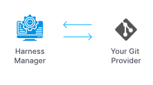
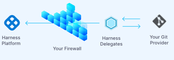

# Harness Git Sync Folder

## What is a Harness Folder?
Harness folder allows to save the Harness configurations like pipelines, connectors, delegates, trigger, etc alongside with the code in your git repository.

## What is a Connector?
Connectors integrate Harness with your cloud platforms, codebase and artifact repos, and collaboration and monitoring tools.

## How do you want to connect to the Git Provider?

### Connect Through Manager
Communication with the Git provider will be made through the Harness manager which will reduce the response time.

### Connect Through Delegate
Communication with the Git provider will be made through the delegate. This provides enhanced security but will result in slower response time.

